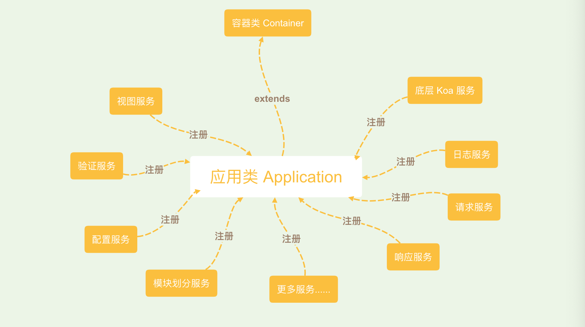

# 架构

框架底层是一个 IOC 容器, 非常精简，我们用的所有功能大多数都是绑定在容器中进行管理

其中应用类（Application）既是继承了容器拥有容器的所有功能的对象，也是绑定在容器中的一个实例。

怎么理解这句话和上面那张图呢？

我们框架的底层核心只是一个容器（Container），所有的服务都绑定在容器中，应用类（Application）也不例外，但是应用类继承了容器这个基类，拥有容器的全部功能，所以一般情况下我们通过应用类即可完成容器的所有功能，并且应用类提供了服务注册的功能（通过提供者的形式），所以可以在应用类中注册服务的时候绑定到容器中，使用容器进行管理。

## 目的
为什么要这么做？

- 性能：首先作为一个框架，我们需要保证框架的精简与基础功能，保证框架运行的速度和大小，框架所有的功能都是由提供者提供，通过自动实例化功能实现真正的按需加载。
- 解耦：由于所有的功能都需要提供者注册到应用中（内置了大量功能，按需引入即可），服务和框架之间的耦合非常低，框架的可伸缩性非常高。
- 兼容性：容器与提供者的特性决定了框架可以兼容你想要的所有服务，只需要编写对应的提供者注册文件即可。
