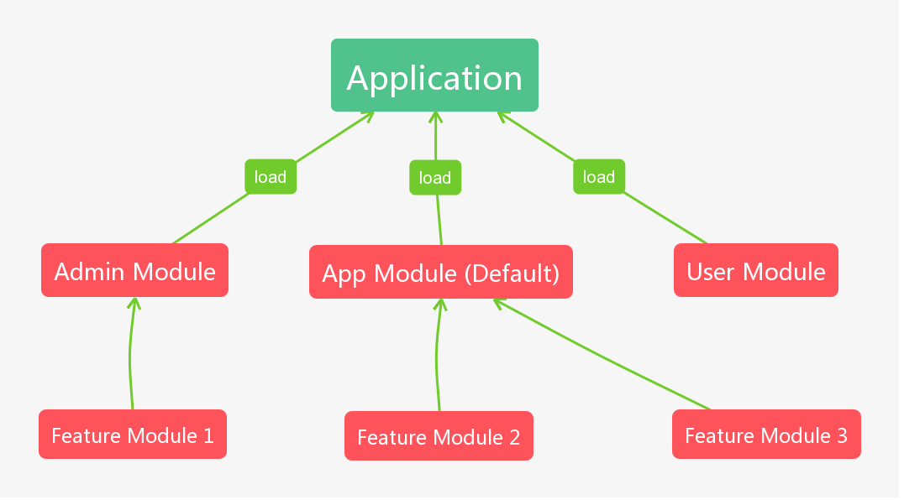

# 模块
模块是应用程序的组成单位，每个模块可以装载控制器、中间件、子模块等

我们可以使用模块功能对应用程序进行模块化设计




## 加载模块
使用 `Application` 实例的 `loadModule` 方法来加载应用的根模块，我们在入口文件 `src/app/index.js` 中直接加载模块：

```js {17}
/**
 * Dazejs - A Javascript Framework For Nodejs
 *
 * @package  @dazejs/framework
 * @author   Chan Zewail <chanzewail@gmail.com>
 */
const { Application } = require('@dazejs/framework')

/**
 * Create The Application
 */
const app = new Application(__dirname)

/**
 * Load Module
 */
app.loadModule('app.module')

/**
 * Run The Application
 */
app.run()

```
::: tip
框架首次初始化的时候已经加载了 `app.module.js` 文件作为模块
:::

## 模块定义
我们使用 `@Module` 装饰器来表示这是一个模块

```js {3}
const { Module } = require('@dazejs/framework')

@Module()
class AppModule {
  resolve() {
      // ...
  }
}

module.exports = AppModule

```

::: tip
模块中可以实现 `resolve` 方法来表示该模块需要运行什么，`resolve` 方法会在模块初始化的时候被执行
:::

### 工具
可以使用 `Daze CLI` 工具创建模块文件:
```bash
$ daze make module user.module
```
上述命令将在 `src/app` 下创建 `user.module.js` 模块文件, 然后我们可以在根模块 `src/app/app.module.js` 中引入该模块文件作为子模块, 查看接下来的 `装载子模块` 章节了解更多。


## 加载子模块

使用 `loadModule` 方法来加载子模块

传入模块的引用：
```js {7}
const { Module } = require('@dazejs/framework')
const UserModule = require('./user.js')

@Module()
class AppModule {
    resolve() {
        this.loadModule(UserModule)
    }
}

module.exports = AppModule
```

传入路径的字符串（支持通配符）:

```js {6,7}
const { Module } = require('@dazejs/framework')

@Module()
class AppModule {
    resolve() {
        this.loadModule('modules/home/*.js')
        this.loadModule(path.resolve(__dirname, 'modules/admin/*.js'))
    }
}

module.exports = AppModule
```
::: tip
相对路径相对于应用的 `src/app`目录
:::


## 加载控制器

使用 `run` 方法来加载控制器

传入控制器的引用：
```js {8,9}
const { Module } = require('@dazejs/framework')
const UserController = require('./controller/user.js')
const PostController = require('./controller/post.js')

@Module()
class AppModule {
    resolve() {
        this.run(UserController)
        this.run(PostController)
    }
}

module.exports = AppModule
```

传入路径字符串（支持通配符）：

```js {6,7,8}
const { Module } = require('@dazejs/framework')

@Module()
class AppModule {
    resolve() {
        this.run('home/*.js')
        this.run('admin/**')
        this.run(path.resolve(__dirname, 'controller/web/*.js'))
    }
}

module.exports = AppModule
```

::: tip
相对路径相对于 应用的 `src/app/controller`目录
:::

